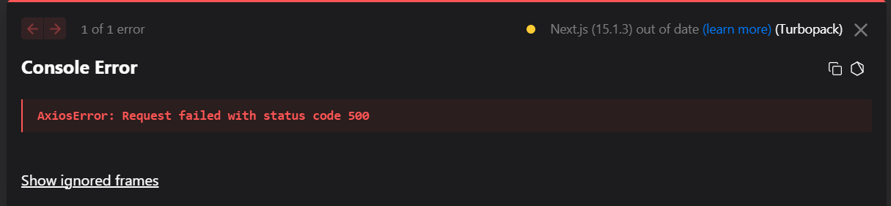

# Common Issues & Debugging Guide

## 1. PHP Version Error
**Error:**
```
Root composer.json requires php ^8.2 but your php version (8.1.2) does not satisfy that requirement
```
**Solution:**
- Upgrade PHP to 8.2+ using the `ondrej/php` PPA and install required extensions.

## 2. Missing PHP Extensions
**Error:**
```
Fatal error: Uncaught Error: Class "Normalizer" not found
```
**Solution:**
- Install missing extensions:
  ```bash
  sudo apt install php8.2-intl php8.2-xml
  ```

## 3. MySQL Not Installed or Not Running
**Error:**
```
Unit mysql.service could not be found.
```
**Solution:**
- Install and start MySQL:
  ```bash
  sudo apt install mysql-server -y
  sudo systemctl start mysql
  sudo systemctl enable mysql
  ```

## 4. Database Connection Issues
**Error:**
- Laravel cannot connect to MySQL.
**Solution:**
- Ensure `.env` DB settings match your MySQL user, password, and database.
- Create the database and user if needed.

## 5. Frontend Network Error (Axios)
**Error:**
```
AxiosError: Network Error
```
**Solution:**
- Ensure backend is running on port 8000.
- Set `baseURL` in `frontend/axios.js` to `http://localhost:8000/api`.
- Check CORS settings in `config/cors.php`.

## 6. Next.js Font or Turbopack Issues
**Error:**
```
Module not found: Can't resolve '@vercel/turbopack-next/internal/font/google/font'
```
**Solution:**
- Use Webpack instead of Turbopack:
  ```bash
  npm run dev
  ```
- Ensure your `package.json` dev script is:
  ```json
  "dev": "next dev"
  ```

## 7. Vite Not Found
**Error:**
```
sh: 1: vite: not found
```
**Solution:**
- Make sure your Next.js project uses `next dev` and not `vite` in `package.json`.

## 8. Creating Tasks via API
- Use Postman or curl to POST to `/api/tasks` as shown in the build guide.
## 9. Fixing old Nexjs error

---

If you encounter other issues, check logs and ensure all services are running and ports are correct. 